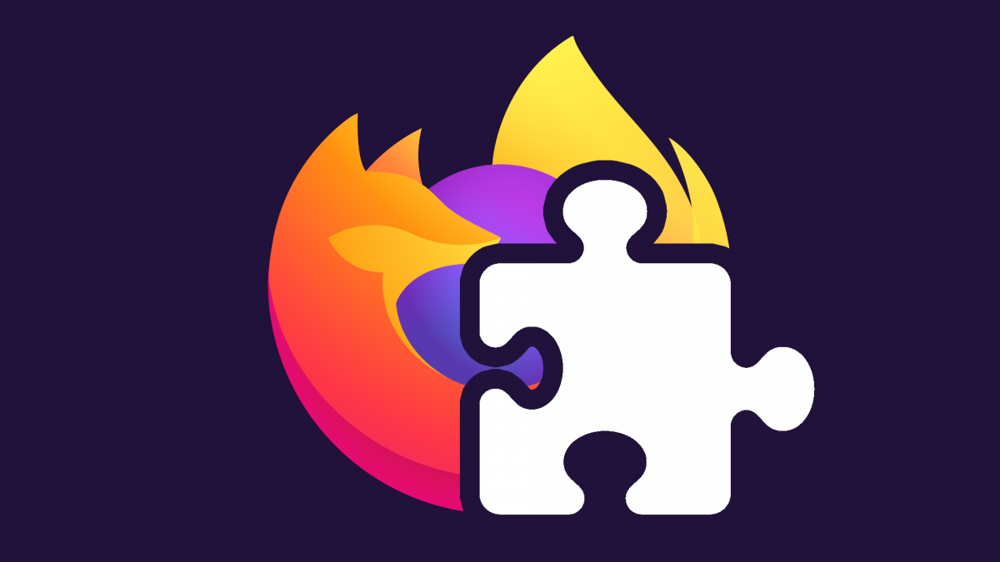

# ♟️🛡️ ChessEloShield 🛡️♟️

Stops ELO-draining tilt on chess.com. After a loss, it starts a configurable **cooldown** and freezes ways to start a new game (Quick Play, Start Game, New 1 min, Rematch). Buttons show a **MM:SS** countdown via a CSS overlay (no React flicker). Cooldown survives page changes/reloads. Optional **Hide chat** and **Hide opponent info**. A subtle **Remove Cooldown** link is available in the popup.

## Folders

- `Firefox/` — MV2 (AMO).
- `Chrome/` — MV3 (Chrome Web Store).

## Permissions (why)

- `storage` — save cooldown duration + toggles + `cooldownUntil` timestamp.
- `tabs` — broadcast state to chess.com tabs.
- `webNavigation` — catch SPA navigations to re-apply state.
- `alarms` — wake exactly at cooldown expiry.
- Host `https://www.chess.com/*` — run only on chess.com.

## How it works

- **Content script** reads the game-over header/post-game text.
  - “You Won!” → ignore.
  - “White Won/Black Won” or “won by …” → start cooldown.
- **Background** stores state in sync storage, schedules an alarm, and **broadcasts** `{ type: "tilt-guard/state", until, settings }` to all chess.com tabs on start/expire/navigation.
- **CSS** sets `tg-cooling` + `--tg-timer` and overlays **MM:SS** without DOM churn.
- Loss detection pauses until **URL changes** after cooldown ends or manual removal (prevents loops on the same loss screen).

## Popup

- Presets: 5s / 15s / 1m / 3m / 5m + custom.
- Toggles: **Hide chat**, **Hide opponent info**.
- **Remove Cooldown** link (bottom-right).

## Privacy

No analytics. No network calls. Only local sync storage: `settings`, `cooldownUntil`.

## License

MIT
